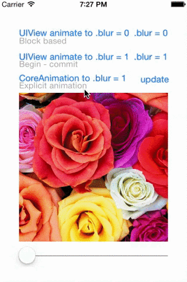

UIView+Blur
===========

A UIView category to blur a view.

Installation
--------------

UIView+Blur can be installed by copying the files inside the *UIViewBlur* directory.

There is also a *UIViewBlur.podspec* **podspec file** you can easily add UIView+Blur to your project adding this line to your Podfile:

	pod "UIViewBlur", :podspec => "https://raw.github.com/Fr4ncis/UIViewBlur/master/UIViewBlur.podspec"
	
We will soon fully support Cocoapods to provide an even easier method to integrate it in your project.

Getting started
---------------

After integrating UIView+Blur into your project, a new `blur` property is available for all UIViews.

	@property (nonatomic, assign) float blur;

**IMPORTANT** Whenever the property is *set for the first time*, snapshots of the UIView backing layer will be created, therefore be careful memory and CPU-wise it's quite an intensive operation.

Snapshots are created the first time `blur` property is set. 

### Animations

You can access the `blurredLayer` property of the UIView and set the blur value directly. You can also animate the value with explicit CoreAnimation animations.

    // adds the blurred layer to the image, creates snapshots
    self.imageView.blur = 0;
    
    CABasicAnimation *animation = [CABasicAnimation animationWithKeyPath:@"blur"];
    [animation setFromValue:@(0.0)];
    [animation setToValue:@(1.0)];
    [animation setDuration:2.0f];
    [self.imageView.blurredLayer addAnimation:animation forKey:@"blur"];
    
    // THIS IS THE RIGHT WAY TO MAKE AN ANIMATION CONSISTENT AT THE END
    self.imageView.blurredLayer.blur = 1;

Technical details
-----------------

The library has been written using ARC. It can still be used on non-ARC projects by enabling the `-fobj-arc` compiler flag on the *.m files*.

The library was tested on **iOS 7 only**, but it should work on previous iOS versions as well.

### Fine tuning

There are some macros defined in UIView+Blur.m 

	#define maxBlurRadius 20.0f
	
defines the maximum blur radius used (ranges between 0 to `maxBlurRadius`).
	
	#define steps 20
	
number of images stored, the higher the number the slower the -updateSnapshots method takes.
	
	#define asyncBlur YES
	
on `-updateSnapshots` setting this macro to NO blurs the snapshot on the main thread, blocking the UI.

**IMPORTANT** By setting it to YES, the snapshot will be blurred in the background with low priority but it may delay to show the blurred effect.

### Implicit animations

CoreAnimation explicit animations work by setting the `blur` property on the blurredLayer as stated above.

UIView animations (e.g. `[UIView animateWithDuration:..]`) do not work, there are hacks (method swizzling) to make them work, but I would stick to CoreAnimation.

You can enable implicit animations by setting the relative macro

	#define implicitAnimationsDisabled YES
	
This will actually make `-actionForKey:` on the *CABlurLayer* return an animation.

To animate then just set the blur property on the UIView blurredLayer

	self.imageView.blur = 0; // creates the blurredLayer (needed just the first time!)
    self.imageView.blurredLayer.blur = 1;
    
Refer to the demo porject UIViewBlurDemo for a concrete example on how to use the category.

Considerations & Donations
--------------------------

I started this project after seeing Twitter.app background image blurred when dragging a scrollview.

This is an open-source project built during my spare time, feel free to contribute to the project.
I got to learn something more about CoreAnimation, so I hope you appreciate the effort ;)

If you want to get some specific features implemented first or you need help to set it up in your own project, [get in touch](mailto:ego@fr4ncis.net).

To speed-up development [donations](https://www.paypal.com/cgi-bin/webscr?cmd=_s-xclick&hosted_button_id=FQPB9PZGVBXL2) are very welcome.
